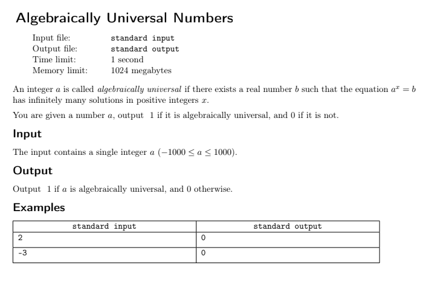
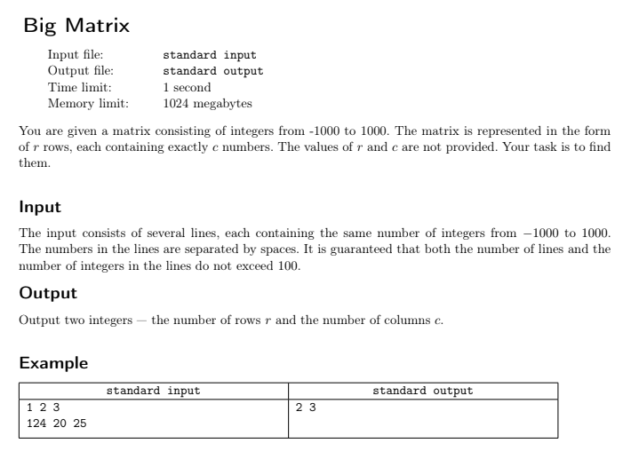
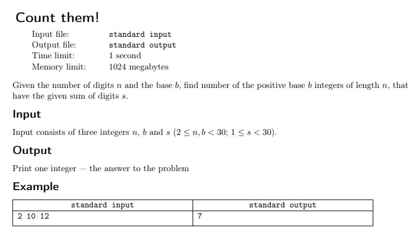
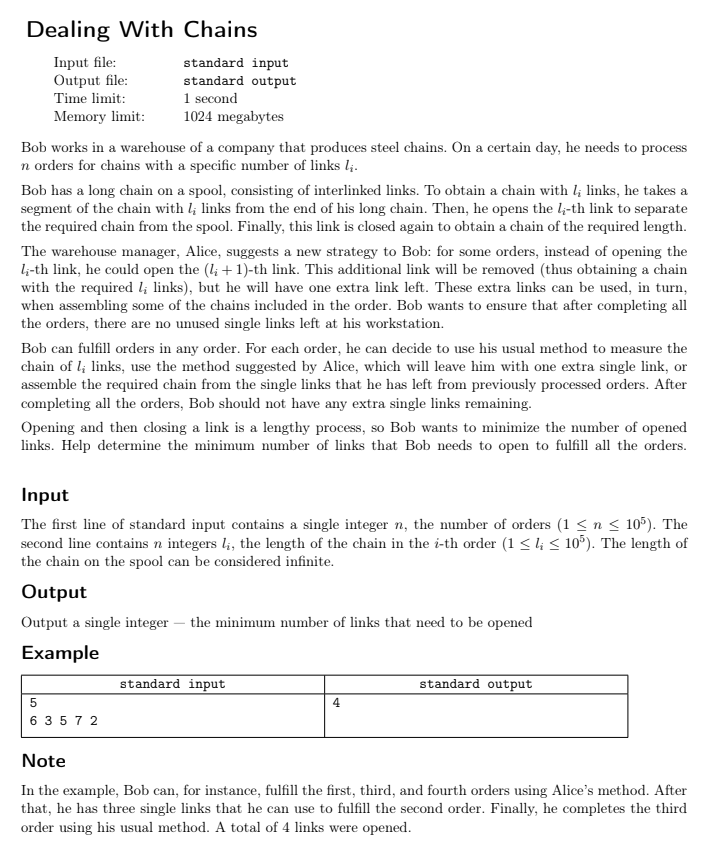
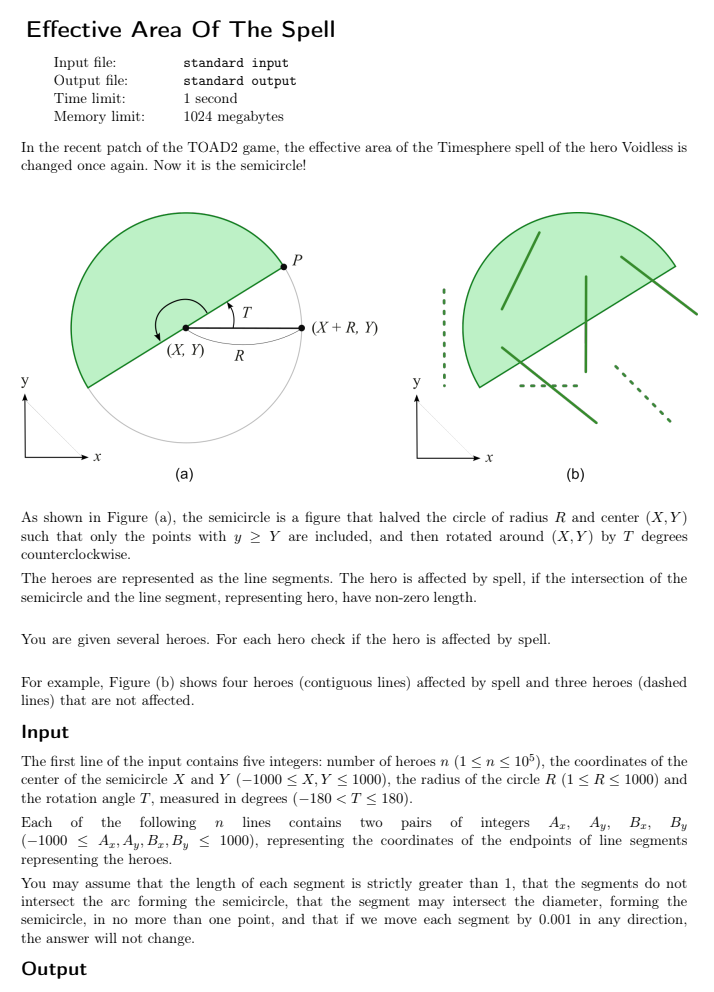
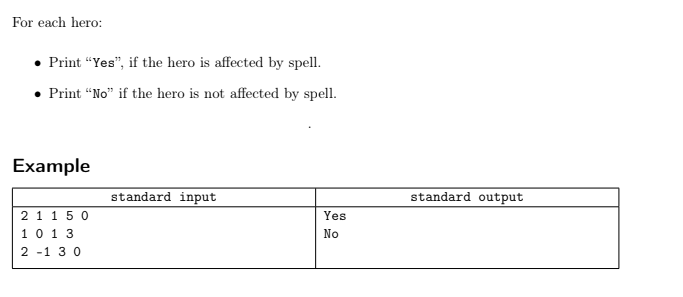
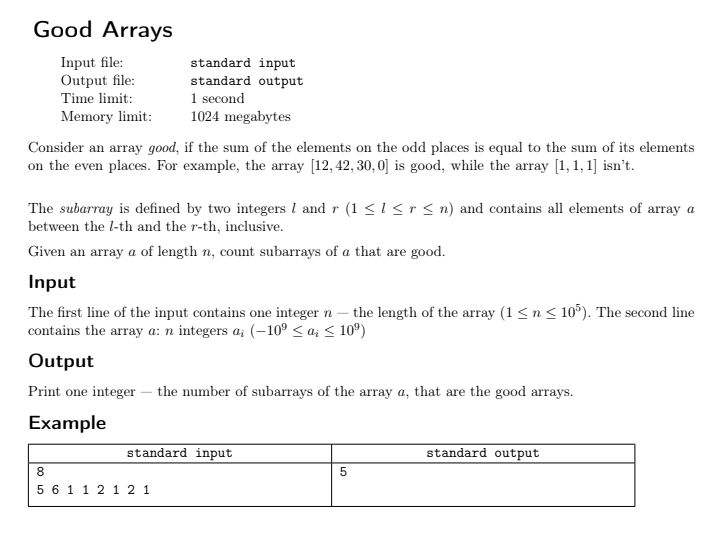

# 🧠 Yandex Contest Solutions

This repository contains my solutions to six problems from a recent Yandex programming contest. The problems are labeled **Question A** through **Question F**, and each includes the original problem statement and my Python solution.

---


## 📌 Questions and Solutions

### 🅰️ Question A

#### 🖼️ Problem Statement  


#### 💡 Solution  
[solution-a.py](solutions/solution-a.py)

```python
numcha = int(input())
if numcha in [-1, 0, 1]:
	print(1)
else:
	print(0)
```

---

### 🅱️ Question B

#### 🖼️ Problem Statement  


#### 💡 Solution  
[solution-b.py](solutions/solution-b.py)

```python
lines = []

while True:
	try:
		line = input().strip()
		if line:
			lines.append(line)
	except EOFError:
		break
rows = len(lines)
if rows > 0:
	cols = len(lines[0].split())
else:
	cols = 0

print(rows, cols)
```

---

### 🇨 Question C

#### 🖼️ Problem Statement  


#### 💡 Solution  
[solution-c.py](solutions/solution-c.py)

```python
n, b, s = map(int, input().split())

cache = {}

def count_numbers(n, s, birinchi_son):
    key = (n, s, birinchi_son)
    if key in cache:
        return cache[key]
    
    if n == 1:
        if birinchi_son:
            cache[key] = 1 if (1 <= s < b) else 0
        else:
            cache[key] = 1 if (0 <= s < b) else 0
        return cache[key]
    
    res = 0
    start = 1 if birinchi_son else 0
    for d in range(start, b):
        if s - d >= 0:
            res += count_numbers(n - 1, s - d, False)
    
    cache[key] = res
    return res

print(count_numbers(n, s, True))
```

---

### 🇩 Question D

#### 🖼️ Problem Statement  


#### 💡 Solution  
[solution-d.py](solutions/solution-d.py)

```python
def min_opened_links(n, orders):
    orders.sort()
    
    extra_links = 0 
    opened_links = 0 
    
    while orders:
        if extra_links >= orders[0]:
            extra_links -= orders[0]
            orders.pop(0)
        elif len(orders) >= 2:
            opened_links += 1
            extra_links += 1
            orders.pop() 
        else:
            opened_links += 1
            orders.pop()
    
    return opened_links

def main():
    n = int(input().strip())
    orders = list(map(int, input().strip().split()))
    
    result = min_opened_links(n, orders)
    print(result)

main()
```

---

### 🇪 Question E

#### 🖼️ Problem Statement  



#### 💡 Solution  
[solution-e.py](solutions/solution-e.py)

```python
from math import cos, sin


def is_point_in_semicircle(x, y, center_x, center_y, radius, angle):

    x_translated = x - center_x
    y_translated = y - center_y
    
    angle_rad = -angle * (3.14159265358979323846 / 180.0)
    x_rotated = x_translated * cos(angle_rad) - y_translated * sin(angle_rad)
    y_rotated = x_translated * sin(angle_rad) + y_translated * cos(angle_rad)
    
    dist_squared = x_rotated * x_rotated + y_rotated * y_rotated
    return dist_squared <= radius * radius and y_rotated >= 0

def line_intersects_semicircle(ax, ay, bx, by, center_x, center_y, radius, angle, eps=0.0101):
    def check_point(t):
        x = ax + (bx - ax) * t
        y = ay + (by - ay) * t
        return is_point_in_semicircle(x, y, center_x, center_y, radius, angle)
    
    if check_point(0) or check_point(1):
        return True
        
    left, right = 0, 1
    for _ in range(100):
        if right - left < eps:
            break
            
        mid = (left + right) / 2
        if check_point(mid):
            return True
            
        mid_left = (left + mid) / 2
        mid_right = (mid + right) / 2
        
        if check_point(mid_left):
            right = mid
        elif check_point(mid_right):
            left = mid
        else:
            left_inside = check_point(left)
            right_inside = check_point(right)
            if left_inside != check_point(mid):
                right = mid
            elif right_inside != check_point(mid):
                left = mid
            else:
                break
                
    return False

def main():
    from math import cos, sin
    
    n, x, y, r, t = map(int, input().split())
    
    for _ in range(n):
        ax, ay, bx, by = map(int, input().split())
        
        affected = line_intersects_semicircle(ax, ay, bx, by, x, y, r, t)
        print("Yes" if affected else "No")


main()
```

---

### 🇫 Question F

#### 🖼️ Problem Statement  


#### 💡 Solution  
[solution-f.py](solutions/solution-f.py)

```python
def count_good_subarrays(n, arr):
    count = 0
    diff = 0
    diff_count = {0: 1} 
    
    for i in range(n):
        if i % 2 == 0:
            diff += arr[i]
        else:
            diff -= arr[i]
            
        count += diff_count.get(diff, 0)
        diff_count[diff] = diff_count.get(diff, 0) + 1
    
    return count

def main():
    n = int(input().strip())
    arr = list(map(int, input().strip().split()))
    
    result = count_good_subarrays(n, arr)
    print(result)


main()
```

---

## 🚀 Notes

- The contest was hosted by **Yandex** and featured algorithmic challenges of varying difficulty.
- All solutions are implemented in **Python**.
---

